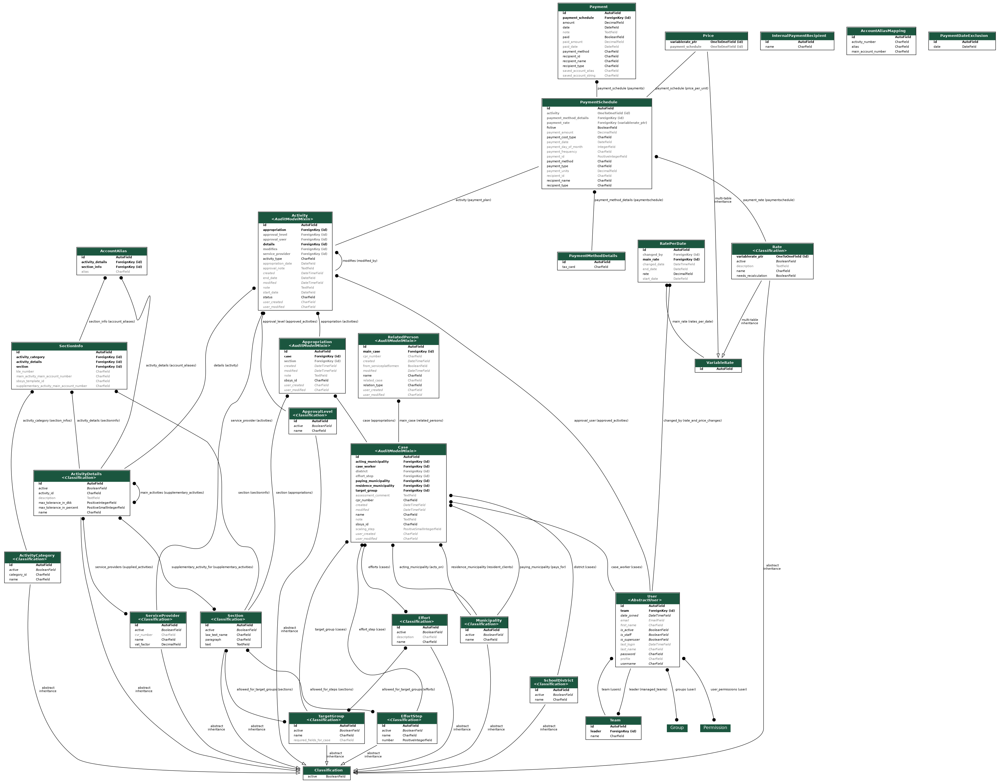

.. BOS Backend documentation master file, created by
   sphinx-quickstart on Mon Nov 18 14:43:09 2019.
   You can adapt this file completely to your liking, but it should at least
   contain the root `toctree` directive.

Backend documentation
=====================

Authentication
--------------

Authentication in OS2BOS is based on SAML 2.0 single sign-on. Support for this is implemented through the module `PySAML2`_.

.. _PySAML2: https://github.com/IdentityPython/pysaml2

Once a user has been authenticated, a session is created containing the attributes given to us from the IdP, e.g. the Active Directory groups the user belongs to.

SAML based single sign-on (SSO)
^^^^^^^^^^^^^^^^^^^^^^^^^^^^^^^

SAML SSO delegates the login process to the IdP, and as such, requires an IdP supporting SAML single sign-on.

Settings related to SAML SSO can be found in the ``SAML2_AUTH`` object in ``settings.py``.

User setup
""""""""""

In local development and test, SAML SSO is used with `SimpleSamlPHP`_ as idP.

Users and user profiles are defined in ``dev-environment/authsources.php`` for local development. If you wish to add a new user, you need to add an entry to the file following this template:

.. code-block::

   '<brugernavn>:<password>' => array(
        'email' => '<email_adresse>',
        'username' => '<brugernavn>',
        'first_name' => '<fornavn>',
        'last_name' => '<efternavn>',
        'team' => '<team (navn)>',
        'bos_profile' => '<profil>'
   ),

A user that is not allowed to use OS2BOS, must have a SAML-token with an empty or missing ``bos_profile`` entry. 

User profiles
"""""""""""""
There are five user profiles corresponding to five different levels of permissions.

- "readonly" - the user can only read, not write.
- "edit" - the user can both read and write, but cannot perform grant operations.
- "grant" - the user can both read, write and perform grant operations, but cannot access Django admin.
- "workflow_engine" - the user can both read, write and perform grant operations, and can access only classifications in Django admin.
- "admin" - the user can read, write, perform grant operations and access Django admin.

.. _SimpleSamlPHP: https://simplesamlphp.org/

Integrations
------------

Serviceplatformen
^^^^^^^^^^^^^^^^^

We use Serviceplatformen to fetch information from the CPR register. Support for this is implemented through the module `service_person_stamdata_udvidet`_.

Settings relevant to Serviceplatformen can be found in the ``SERVICEPLATFORM_UUIDS`` object and the ``SERVICEPLATFORM_CERTIFICATE_PATH``, ``USE_SERVICEPLATFORM``, ``USE_SERVICEPLATFORM_PROD`` keys in ``settings.py``.

.. _service_person_stamdata_udvidet: https://github.com/magenta-aps/service_person_stamdata_udvidet

Virk.dk
^^^^^^^

We use Virk.dk to fetch information from their CVR register. Support for this is implemented through the module `virk.dk`_.

Settings relevant to Virk.dk are the ``USE_VIRK``, ``VIRK_USER``, ``VIRK_PASS`` and ``VIRK_URL`` keys found in ``settings.py``.

.. _virk.dk: https://github.com/magenta-aps/virk.dk

PRISME
^^^^^^

OS2BOS can export daily payment files for import into the `PRISME` economy system. The format of the files are based on KMD's interface specification `GF200001Q`_ for creditor records (transaction type G68).

.. _PRISME: https://www.fujitsu.com/dk/products/software/prisme/
.. _GF200001Q: https://www.kmd.dk/loesninger-og-services/it-services/snitflader-og-data-warehouse/snitfladebeskrivelser

Generating database documentation
---------------------------------

The database documentation can be found in an online version here: `os2bosdocs`_.

We generate database documentation using the tool `SchemaSpy`_.
The following commands are run from inside the container as root: ``docker-compose exec -u 0 bev bash``

Install a JRE:

.. code-block:: bash

   apt-get install default-jre

Install graphviz:

.. code-block:: bash

   apt-get install graphviz

Download the latest ``schemaspy.jar``

.. code-block:: bash

   wget https://github.com/schemaspy/schemaspy/releases/download/v6.1.0/schemaspy-6.1.0.jar -O schemaspy.jar

Download the latest JDBC for Postgresql:

.. code-block:: bash

   wget https://jdbc.postgresql.org/download/postgresql-42.2.8.jar -O postgresql.jar

Run SchemaSpy against the database:

.. code-block:: bash

   java -jar schemaspy.jar -dp postgresql.jar -t pgsql -s public -db bev -host db -u bev -p bev -o er_html

The documentation is now found in the ``er_html`` folder.

.. _SchemaSpy: http://schemaspy.org/
.. _os2bosdocs: https://magenta-aps.github.io/os2bos-docs/

Django debugging
----------------

To debug end-to-end you can set the ``breakpoint()`` you want and use ``docker attach``:

.. code-block:: bash

   docker attach bevillingsplatform_bev_1

Release procedure
-----------------
We manage releases using the `Gitflow`_ model.

.. _Gitflow: https://nvie.com/posts/a-successful-git-branching-model/

- Create a release branch for the release, e.g. ``release/1.0.0``.
- Bump the version and changelog in ``NEWS.rst`` and ``VERSION`` according to `Semantic Versioning`_.
- `Optional`: Check our dependencies for new security bugfixes.
- `Optional`: In case of API changes, save the OpenAPI schema ``openapi.yml`` from ``<OS2BOS URL>/api/openapi/?format=api`` for use in documentation.
- `Optional`: In case of model changes, update the database model graph by running `tox -e graph` for use in documentation.
- Test the release and verify that it doesn't contain any breaking bugs or regressions.
- Create an ``rc`` tag, e.g. ``1.0.0-rc1`` on the release branch to make it deployable on staging.
- In case of further development, make pull requests against the release branch and create a new ``rc`` tag.
- Proceed with development and rc-tagging on the release branch until the customer is happy.
- Create a pull request from the release branch to ``master`` for review of ``VERSION`` and ``ǸEWS.rst`` bump.
- Create a pull request from the release branch to ``develop``.
- Merge the pull requests.
- Create a release tag, e.g. ``1.0.0`` from ``master``.
- Push develop, master and tags to `the OS2BOS Github`_ as the new core version.
- Delete the release branch.

.. _Semantic Versioning: https://semver.org/
.. _the OS2BOS Github: https://github.com/OS2bos/os2bos/

Code documentation
------------------

.. toctree::
   :maxdepth: 2
   :caption: Contents:
   
   core.rst
   bevillingsplatform.rst
   manage.rst

Indices and tables
^^^^^^^^^^^^^^^^^^

* :ref:`genindex`
* :ref:`modindex`
* :ref:`search`

API documentation
-----------------
.. openapi:: openapi.yml
   :examples:

