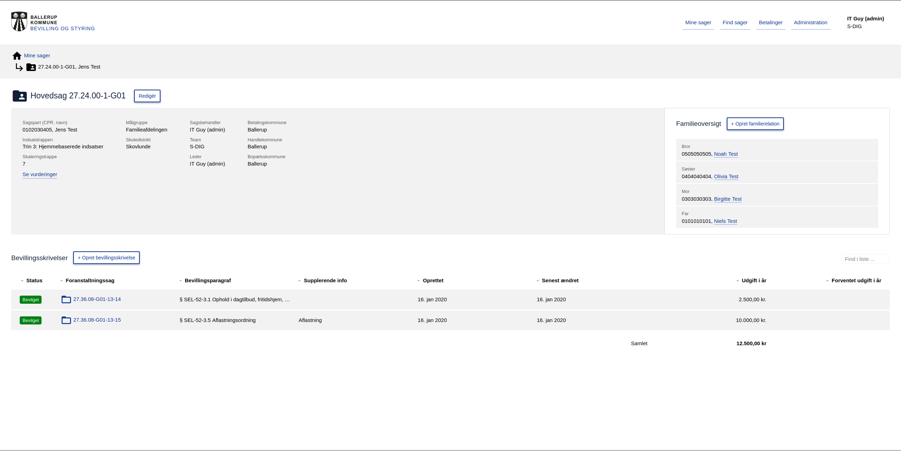

=========
Om OS2BOS
=========

Introduktion
============
BOS er en webapplikation til håndtering af foranstaltninger og bevillinger for kommunens socialrådgivere.
Formålet med BOS er at give socialrådgiverne bedre redskaber til at benytte de bedste foranstaltninger og give kommunen som helhed bedre indblik og styringsmulighed i forhold til foranstaltninger, effekter, økonomi og budget.

Navnet BOS dækker over "Bevilling og Styring".

Nedenstående figur viser et typisk eksempel på en side i systemets brugergrænseflade:

Opbygning
=========

--------
Frontend
--------
BOS frontenden er skrevet i Javascript frameworket `Vue.js`_. Brugeren interagerer med denne og frontenden kommunikerer med backenden via. et REST API i JSON format.

.. _Vue.js: https://vuejs.org/

-------
Backend
-------
BOS backenden er skrevet i `Python`_ og benytter `Django`_ samt `Django Rest Framework`_. Data bliver persisteret i en `PostgreSQL-database`_ og udstilles og manipuleres via et REST API.

.. _Python: https://www.python.org/
.. _Django: https://www.djangoproject.com/
.. _Django Rest Framework: https://www.django-rest-framework.org/
.. _PostgreSQL-database: https://www.postgresql.org/
